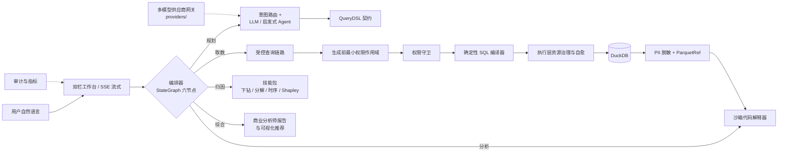

# 架构与设计

## 架构总览

DataAgent 在"受控 DSL → 确定性 SQL"核心链路之上，叠加图式编排、沙箱分析、归因技能与多模型供应商网关，构成企业级 Data Agent：

编排器的六节点为：澄清 HITL → 规划 → 受控取数 → 沙箱分析 → 反思重规划（≤3 次受控自愈）→ 综合报告；计划为步骤 DAG，全过程经 SSE 以九类事件实时推送。

## 核心原则

- **受限生成**：LLM 只输出契约内 JSON；Pydantic 模型使用 `extra="forbid"`。
- **确定性编译**：SQL 只由 `compiler/sql_compiler.py` 生成，不接受模型直接提交裸 SQL。
- **裸 SQL 三重防线**：字符串载荷 / SQL 键 / 自由文本 SQL 形态在网关层直接拒绝（`GuardrailViolation`），"LLM 永不产出裸 SQL"贯穿主链路与编排层。
- **语义白名单**：逻辑字段必须登记在 `semantic/catalog.py`，Join 由目录规则控制。
- **纵深防御**：生成前注入主体可见字段，生成后再经过表级、列级与行级策略校验。
- **受控执行**：执行层提供只读 SQL 校验、超时取消、扫描行数熔断与返回行数上限。
- **沙箱隔离**：沙箱代码解释器经 AST 静态守卫 + 限权 runner（模块白名单 import、workspace 受限 open）+ 可插拔后端（Docker `--net=none --cap-drop=ALL` 强隔离 / 子进程兜底）执行；取数结果 PII 脱敏后物化为 ParquetRef（sha256 可审计），沙箱零网络、零 DB socket，聚合矩阵 ≤100 行防数据外泄。
- **可追溯交付**：查询结果同时提供 DSL、SQL、中文解释、可视化建议与审计记录。

## 技术栈

| 组件 | 选型 |
| --- | --- |
| 语言 | Python 3.11+（项目环境使用 Python 3.12） |
| 数据校验 | Pydantic V2 |
| 本地数仓 | DuckDB |
| 图式编排 | StateGraph 六节点（条件边 + HITL 中断恢复） |
| 沙箱后端 | Docker 强隔离 / 子进程兜底（可插拔） |
| 模型接入 | 多供应商网关：OpenAI Chat / Responses、Anthropic、Gemini 协议适配 |
| Web | Python 标准库 `http.server` + 原生 JS 双栏工作台（vendored ECharts / PrismJS，零前端框架） |
| 质量 | pytest、black、ruff、Golden Dataset |

## 全链路能力

| 层级 | 关键能力 | 入口 |
| --- | --- | --- |
| 语义 | 聚合、比率、时间过滤、窗口指标、日期补零、分组 Top-N | `semantic/` |
| Agent | LLM / 启发式双路径、意图路由、RAG、澄清与多轮槽位回填、观察驱动重规划、对比分解综合、反思层 | `agent/` |
| 编排 | StateGraph 六节点、步骤 DAG 计划、HITL 澄清中断恢复、反思重规划 ≤3 次自愈、九类 SSE 事件 | `core/orchestrator/` |
| 取数 | DSL 管道 typed Tool 化、PII 脱敏（列名启发式 + 值形态正则）、ParquetRef 物化、裸 SQL 网关守卫 | `core/retrieval/` |
| 沙箱 | AST 静态守卫、限权 runner、Docker/子进程可插拔后端 | `core/sandbox/` |
| 技能 | 熵下钻、乘法/加法指标分解树、DTW 相似性、Holt-Winters 异常检测、Shapley 值归因 | `core/skills/` |
| 模型网关 | 多供应商 CRUD（Key 落盘加密不回传）、连通性探测、请求级模型切换 | `providers/` |
| 编译 | 确定性 DuckDB SQL、同比/环比、多事实表受控 Join | `compiler/` |
| 执行 | 超时取消、扫描/结果熔断、只读白名单、SQL 自愈 | `exec/` |
| 展示 | 商业分析师四段式报告、中文业务解释、number/line/bar/pie/table 推荐 | `present/` |
| 治理 | 认证、作用域、表/列/RLS、审计、结构化日志、指标 | `auth/` `security/` `audit/` |
| 交付 | 双栏工作台、健康检查、查询 API、编排端点、指标 API | `web/` |

更多运行步骤、配置与接口说明见：

- [快速开始](quickstart.md)
- [环境配置](configuration.md)
- [API 参考](api.md)
