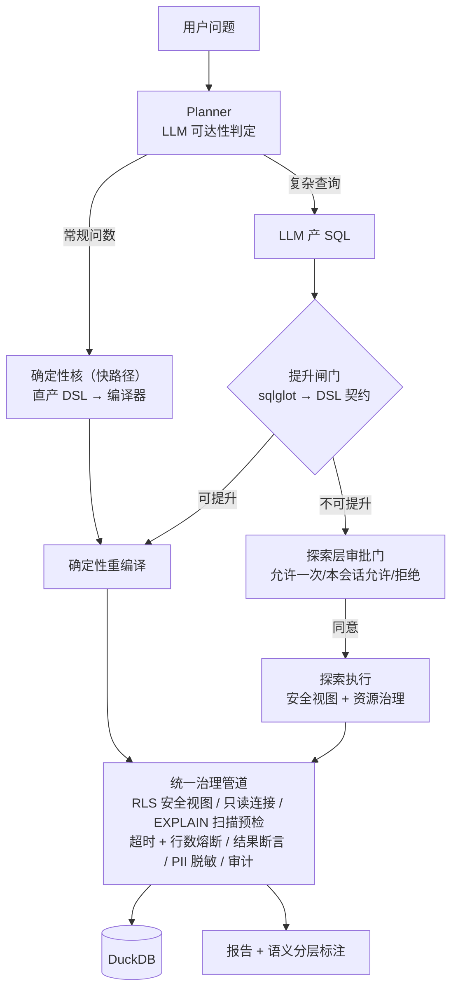

# 设计｜十九期：能力边界扩展——从"契约即边界"到"治理即边界"（2026-10）

> 状态：设计已与用户逐节确认（2026-10-02），待实施。
> 基线：feature/wip @ e5999f7，875 测试绿；十八期意图路由与诚实兜底已合入。
> 决策记录：本文档四项关键取舍经用户逐项拍板，见 §12。

## 0. 背景与问题定位

十八期"兜底准入制 + 宁可拒答不猜口径"在真实企业用户面前暴露了根本矛盾。

**典型案例**：用户问「把全部品牌名列举给我」（多轮会话第 3 轮），系统拒答：

```
识别到维度【品牌】但未识别到任何可查询指标，无法构造查询。
未在语义目录中识别到任何指标或维度。
```

**根因链**（三层叠加，全部源于同一个隐含假设）：

1. **契约层**：`QueryDSL.metrics` 为 `min_length=1` 硬约束（`semantic/dsl_schema.py:318`）——"纯维度取值枚举"在 DSL 层面不可表达，LLM 再正确也产不出合法计划；
2. **意图层**：`classify_intent` 准入清单只有诊断/基数/标量指标三类（`core/orchestrator/intent.py:119-140`），"列举/全部"不在基数量词表（那张表只回答"有多少个"而非"都有什么"），落 `UNKNOWN`；
3. **哲学层**：一期定铁律时隐含假设"用户会提出规范的指标问句"，十八期把这个假设制度化——词表匹配不出即拒答。但企业真实用户（如不知道有哪些品牌的老板）提出的探索性问法恰恰是最合法的问法。

**结论**：约束体系与目标用户错配。能力边界不应由 DSL 契约的表达力画圆，而应由治理管道（只读 + RLS + 敏感数据保护 + 资源上限）画圆——**边界内数据可达即应可答**。

## 1. 哲学转向（三条原则）

1. **能力边界 = 治理管道边界，不是契约表达力**。只读、RLS、敏感列/行保护、资源上限之内，数据可达即应可答。DSL 从"限制表达力的笼子"变为"定义能力边界的闸门"。
2. **诚实 ≠ 拒答，诚实 = 不虚构 + 假设透明**。分级作答：高置信直答 → 中置信带显式口径假设标注作答 → 低置信且影响结果结构时澄清一轮（选项式）→ 仅无数据/敏感/越权才拒答。修订十八期"兜底准入制"的拒答默认；**"绝不虚构数值"红线不动**。
3. **能力越界经用户知情同意**。探索层查询经可视化审批门（允许一次 / 本会话允许 / 拒绝），选择记入审计轨迹。边界不是开发者画死的，是用户知情同意的。

### 铁律改写（AGENTS.md，M7 落地）

- 旧：「严禁绕过 DSL 试图直接拼接生成裸 SQL」
- 新：「**LLM 产出的 SQL 永不直接执行**——必须经提升闸门转译为 DSL 契约后由确定性编译器重新生成，或在安全视图上经受治理探索执行；一切执行只发生在治理管道内」
- 不变的配套铁律：新增逻辑字段必须登记 `semantic/catalog.py`；DSL 模型 `extra="forbid"`。

## 2. 三层同心圆架构



**单执行通道**：三层共享同一条治理管道与同一执行环境，不存在双管道冗余；差异只在"语义理解深度"，且差异必须对用户如实呈现：

| 层 | 输入 | 表达力上限 | 语义理解 | 典型问法 |
| --- | --- | --- | --- | --- |
| L1 确定性核 | Planner 直产 DSL | 扩容后 DSL 契约 | 完整（口径/溯源/可视化推荐/Golden 复现） | 常规聚合问数（约 80%） |
| L2 提升闸门 | LLM SQL → DSL → 重编译 | 扩容后 DSL 契约 | 完整（与 L1 同源） | 复杂但契约可表达（窗口/TopN/比率） |
| L3 探索层 | LLM SQL 原样（安全视图上） | DuckDB 只读全集 | 仅结果级，报告标注"探索查询产出" | 多层 CTE/cohort/漏斗/透视 |

**关键转变**：L2 闸门只决定"走快路径还是慢路径"，**从不决定"能不能答"**——拒升 ≠ 拒答，转入 L3。真正执行不了的只剩治理红线（见 §6）。

## 3. 组件设计

### 3.1 DSL 扩容（`semantic/dsl_schema.py` + `compiler/sql_compiler.py`）

- `metrics` 放开为可空（`min_length=1` 移除），新增**纯维度投影**语义：`dimensions` 非空且 `metrics` 为空时编译 `SELECT DISTINCT <dims> ... ORDER BY 1`；返回行数硬上限（沿用 LIMIT 熔断）兜底无界投影；
- 新增 `having` 子句（聚合后过滤，操作数限指标别名，运算符复用既有白名单）；
- 新增**白名单函数表达式指标**：ratio / coalesce / round / abs 等受控函数对既有指标的组合，函数白名单硬编码于编译器，禁止任意表达式（`extra="forbid"` 契约不变，表达式以结构化 AST dict 描述而非字符串拼接）。

### 3.2 枚举意图（`core/orchestrator/intent.py`）

- 新增 `ENUMERATION` 意图：「列举/列出/有哪些/都有什么/全部」+ 单维度锚 → 确定性直答（构造纯维度投影 DSL）；
- 词表仍以 `FieldMeta.aliases` 为单一事实源，新增字段别名自动生效；
- 兜底模式（无 LLM）下枚举意图同样可答——**根治截图案例不依赖 LLM 在场**；
- 多维度枚举（"列出所有省份和品牌"）M1 先拒答并精确说明，M2 放开（多维投影 DSL 直答，无需等提升闸门）。

### 3.3 提升闸门（新 `core/retrieval/sql_lift.py`）

- sqlglot（新增依赖，DuckDB 方言）解析 LLM SQL → 逐项提升为 DSL 契约：表/列对照语义目录白名单、聚合/过滤/分组/排序提取、CTE 内联（纯引用内联，含计算的 CTE 拒升）；
- **拒升 ≠ 拒答**：产出精确拒升清单（哪个构造、在哪个子句、为什么不可表达），注入 `error_context` 供 LLM 自愈改写（复用既有 ≤3 次闭环）；仍不可表达 → 转探索层审批；
- 保守性优先：解析失败/超时/歧义一律拒升，严禁猜语义放行。

### 3.4 安全视图层（`security/` + `exec/`）

- 按 principal 生成**会话级安全视图**：RLS 行过滤 + 禁列物理投影掉，固化在视图定义；探索层 SQL 只见视图不见基表（命名空间隔离，基表名不可引用）；
- 连接级加固：`read_only` + `enable_external_access=false` + 配置锁定（禁 ATTACH/COPY/文件系统）；
- DSL 核（L1/L2）继续走编译器注入 RLS（双保险），编译器产 SQL 同样改查安全视图。

### 3.5 探索层审批门（`core/orchestrator/` interrupt 泛化第四类）

- 触发：L2 拒升且自愈耗尽 → 挂起中断；
- 前端审批卡（复用 plan_review UI）：SQL 摘要 + 触达表/视图 + EXPLAIN 行数预估 + 敏感列提示；
- 选项：**允许一次 / 本会话允许 / 拒绝**，选择入审计轨迹（新事件 `exploration_approval`）；
- L4 自动档边界：无敏感列 + EXPLAIN 预估在扫描预算内 → 自动放行 + 报告醒目水印；越预算仍挂起。

### 3.6 Planner 双产出契约 + 分级透明作答（`prompts.py` + `nodes.py`）

- Planner 先做**可达性判定**（schema digest + 枚举 profiling 注入），产出二选一：DSL 计划（走 L1）或 SQL（走 L2/L3）；
- 新增 `assumptions` 契约字段（口径假设数组）：时间窗口假设、筛选口径假设、指标口径假设，报告头部显式呈现——**分级透明作答的落点**；
- 置信分级路由：高置信直答；中置信带 `assumptions` 标注作答；低置信且影响结果结构 → 选项式澄清一轮；澄清后仍不确定 → 带 `assumptions` 作答（不再因二轮歧义直接拒答，修订十八期"clarify 轮次上限即拒答"规则）。

### 3.7 兜底模式（无 LLM）

- 保持确定性直答能力（含 3.2 枚举意图），启发式兜底规则不回退；
- 探索层与提升闸门无 SQL 来源，不可用——如实告知（"AI 规划不可用，复杂分析暂无法执行"），不静默降级、不伪造能力清单。

### 3.8 拒答文案修复（`nodes.py`）

`_cannot_answer_report` 的"LLM 已配置"分支按拒答成因分流：能力边界类拒答不再误导用户"检查 LLM 网关连通性"（`nodes.py:2634-2638`），改为告知问法超出当前能力 + 给出最近似可答问法建议。

## 4. 数据流走查（两个验收案例）

**案例 A：「把全部品牌名列举给我」**
意图 `ENUMERATION`（确定性命中）→ DSL 纯维度投影 `{dimensions:[brand], metrics:[]}` → 编译器 `SELECT DISTINCT brand FROM ... ORDER BY 1` → 安全视图（RLS 行过滤生效）→ 品牌清单 + 缺省口径说明。LLM 在场时同样走 L1 快路径。**不再拒答，兜底模式亦可答。**

**案例 B：30 行 cohort 复杂 SQL（新客首单月 × 复购率）**
Planner 判定超 DSL 表达力 → 产 SQL → 提升闸门：多层含计算 CTE 不可内联，拒升清单精确列明 → LLM 自愈一次仍不可表达 → 探索层审批门挂起 → 用户选「本会话允许」→ EXPLAIN 预检 + 扫描预算内 → 安全视图上执行 → 结果断言（空结果/NULL 率）+ PII 脱敏 → 报告标注「本结果由探索查询产出，未经语义契约解释，口径见 SQL 摘要」。

## 5. 错误处理与自愈

| 环节 | 失败 | 处置 |
| --- | --- | --- |
| L2 提升 | 拒升（构造不可表达/解析失败） | 拒升清单 → error_context → LLM 改写 ≤3 次 → 仍失败转审批门 |
| L3 探索执行 | SQL 运行报错 | 既有自愈闭环原样生效（精确报错喂回 LLM） |
| L3 审批拒绝 | 用户选拒绝 | 诚实告知被拒原因 + 最近似可答替代问法，不算错误 |
| 治理管道 | 熔断（超时/扫描/行数） | 既有行为不变，拒因如实呈现 |
| 兜底模式 | LLM 缺席 | 确定性直答 + 枚举意图；复杂分析如实告知不可用 |

## 6. 安全面变化（评审重点）

1. **沙箱 `duckdb.connect` 旁路封堵**（现状核实：`FORBIDDEN_MODULES` 黑名单制，duckdb 可导入，AST 守卫拦不住 C 扩展 connect 调用）：M5 落地安全视图层时同步封堵——AST 检查 `duckdb.connect` 调用，仅放行 `read_parquet` 只读消费；取数权永远只在执行层，沙箱永远是脱敏后数据的使用者；
2. **sqlglot 解析风险**：解析失败/超时/歧义一律拒升（保守性优先），闸门永不"猜语义放行"；
3. **视图逃逸面**：探索 SQL 命名空间隔离（基表名不可引用）+ 连接锁配置（禁 ATTACH/COPY/外部访问）；
4. **L4 自动放行边界**：仅"无敏感列 + 扫描预估预算内"，且必须水印标注；
5. **新增审计事件**：`lift_reject` / `exploration_approval` / `exploration_execute`；
6. Mimosa 式安全复审纳入 M7 验收门，0 高危放行。

**治理红线（五类，全部为用户原始诉求点名保留的限制）**：写操作/DDL；越权列（物理不存在于视图）；越权行（RLS 视图过滤）；外部访问（文件/attach/http）；资源炸弹（EXPLAIN 预检 + 超时 + 行数硬上限）。

## 7. 评测与验收（真实有效用例优先）

**原则：覆盖率只是底线，验收以"真实问法题库"为准。** 每条用例 = 真实业务问法 + 期望行为分级（直答 / 标注答 / 澄清 / 审批 / 拒答）+ **数据真值断言**（对 mock 数仓预计算的期望结果逐值校验，防"跑通但答错"）。纯跑通不计通过。

**题库分层（纳入 `eval/`，红线用例进 CI 必跑）**：

1. **老板自助问法（20+ 条）**：枚举类（把全部品牌名列出来 / 有哪些品类 / 全部省份都有什么）、单指标、分组对比、TopN、同环比、多指标组合——每条带真值断言；
2. **复杂分析问法（10+ 条）**：新客 cohort、退款漏斗、分组内 TopN、窗口累计、交叉表——期望行为 = L2 提升或 L3 审批后答对，结果逐值校验；
3. **口径模糊问法（分级透明作答验收）**：「华南的表现怎么样」（带假设标注或澄清，禁止静默猜）、「最近的趋势」（时间窗口假设标注）——断言：要么发生选项式澄清、要么 `assumptions` 非空且报告可见，**两种都算通过，静默猜口径直答算失败**；
4. **多轮追问链（3 轮+）**：先总后分、追问下钻、修正口径——断言上下文记忆与口径延续；
5. **红线矩阵（必须拒/必须审批，零容忍）**：restricted 角色查 discount_amount（列越权→拒绝）、analyst 查非授权省份（行越权→视图过滤）、写操作/DDL、COPY/ATTACH/读文件、笛卡尔炸弹（预检熔断）、PII 列导出（脱敏）；
6. **兜底模式回归**：无 LLM 下枚举意图确定性直答、复杂分析如实告知、其余诚实拒答。

**新增评测指标**：答非所问率（探索层标注合规率）、假设标注率、越权拦截率（必须 100%）。

**验收门**：题库全绿 + 既有 875 测试零破坏 + Mimosa 安全复审 0 高危 + 评测锚点 `AS_OF_DATE=2024-06-30`、种子 42 不变。

## 8. 里程碑计划（7 次推进，每次测试全绿独立提交）

| # | 里程碑 | 范围 | 验收标准 |
| --- | --- | --- | --- |
| M1 | 快速修复：根治截图案例 | DSL 纯维度投影；`ENUMERATION` 意图；拒答文案分流修复 | 案例 A 直答（含兜底模式）；golden 用例入 CI |
| M2 | DSL 扩容收尾 | `metrics` 可空契约收尾；`having`；白名单表达式指标；审计门适配 | 新契约 golden 用例 + 互斥组合 CompileError 矩阵 |
| M3 | Planner 双产出 + 分级透明作答 | 可达性判定；`assumptions` 契约；置信分级路由（直答/标注/澄清）；报告标注呈现（SQL 产出路径于 M4/M6 接通） | 口径模糊题库（第 3 层）全绿；澄清-标注路由单测 |
| M4 | 提升闸门 | sqlglot 引入；可提升/拒升构造矩阵；拒升清单 + 自愈闭环 | 构造矩阵单测（可升/拒升逐项）；自愈闭环单测 |
| M5 | 安全视图层 | 会话级 principal 视图；连接锁配置；DSL 核双保险；**沙箱 connect 旁路封堵** | 视图逃逸矩阵（基表不可达/禁列不存在/行过滤生效）；旁路单测 |
| M6 | 探索层执行 + 审批门 | L3 执行链路；interrupt 第四类审批门；前端审批卡；L4 自动档；新审计事件 | 案例 B 全链路 E2E；审批状态机单测；L4 边界单测 |
| M7 | 验收收口 | 真实问法题库全量 + 红线矩阵入 CI；Mimosa 安全复审；AGENTS.md 铁律改写、roadmap/architecture 文档更新 | §7 验收门全部通过 |

依赖关系：M1/M2 独立可先行；M3 依赖 M2；M4/M5 可并行；M6 依赖 M4+M5；M7 收口。

## 9. 明确不做与延后项

- **策略可视化配置面板**——【延后至二十期（候选），本期不执行】。本期管理侧配置仍走 `config/policies.json`（结构已支持表/列/行边界，缺的只是可视化编辑面）。此标记仅为范围提示，不进入本期任何里程碑。
- **写操作支持**——永远不做（只读 Data Agent 定位）。
- **沙箱内跑任意 SQL**——不做，性质是锁死现存旁路而非砍能力：取数权只在执行层，沙箱数据入口唯一通道为 ParquetRef（脱敏 + 行数上限）。理由见 §6 第 1 条。
- **跨库/外部数据源**——不做（连接级已封死外部访问）。

## 10. 代价的诚实声明

同一份查询，走 L3 探索层比走 L1/L2"语义理解得少"：DSL 核知道"这是 GMV 环比"，报告可做数值溯源、口径说明、精准可视化；探索层只知道结果矩阵，报告仍能分析数值但口径解释变弱，且**必须**醒目标注。能力不缩水，缩水的是解释力——此差异如实呈现，不掩饰。

## 11. 开放问题（实施中再定，不阻塞设计）

- sqlglot 版本锁定与依赖体积评估（M4 引入时定）；
- 探索层结果可视化推荐降级形态（仅表格 or 复用 ECharts 通用推荐）；
- 多轮会话中"本会话允许"的会话边界定义（SSE 会话 id 复用既有 scope）。

## 12. 决策记录（2026-10-02 用户拍板）

| 决策点 | 选择 |
| --- | --- |
| 口径不确定时的默认行为 | 分级透明作答（直答/标注/澄清/拒答四档） |
| 取数通道演进 | 否决字面双通道；采纳"提升闸门"统一执行通道 |
| 探索层是否纳入本期 | 本期全做（三层一次到位） |
| 能力越界的准入方式 | 可视化审批门（允许一次/本会话允许/拒绝）+ 管理员策略配置；审批是决策界面，安全视图是强制机制，资源治理是稳定性保障，三者缺一不可 |
| 验收标准 | 真实有效用例优先于覆盖率；7 里程碑推进；策略配置面板延后二十期仅做标记 |
